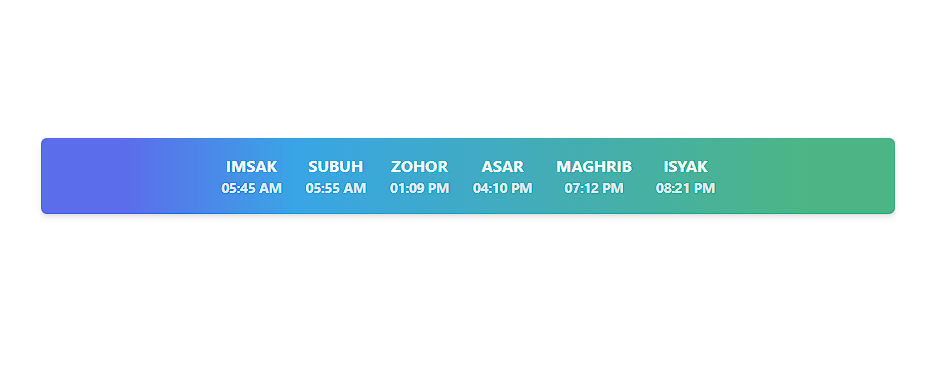
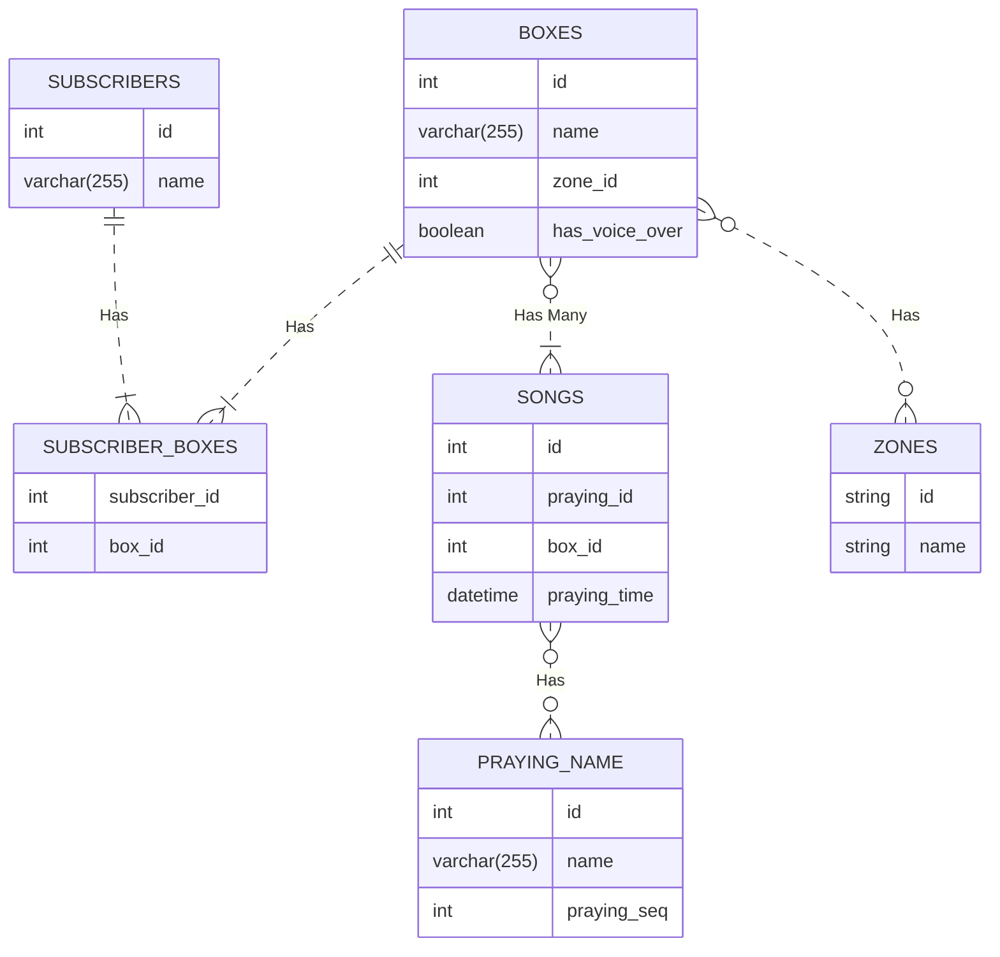
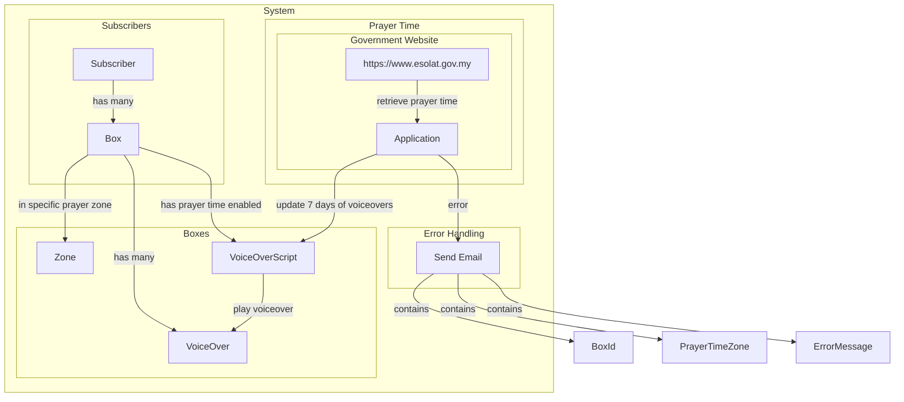
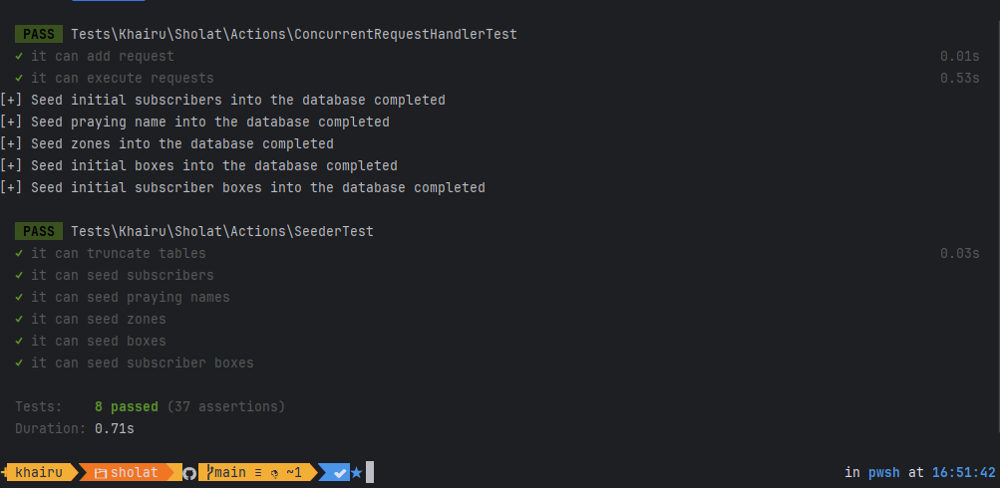

[](https://github.com/khairu-aqsara/sholat-mini-project/actions/workflows/php-tests.yml)
# Mini Project Sholat Time

This project focuses on prayer times and is currently limited to the Malaysian time zone. It automatically plays the Adzan when it's time for prayer



## ERD


## Flow Process


## Installation Guide

### Requirement
```
php 8.2
```

first thing first, we need to install all dependency by running

```bash
composer install
```

This application does not utilize migration scripts. Follow these steps to set it up:

1. Manually create a table by executing the `table.sql` file provided.
2. Modify the database connection configuration in `src/Models/Database.php` as follows:
```php
#src/Models/Database.php
private string $host = 'localhost';
private string $db_name = 'sholat';
private string $username = 'root';
private string $password = 'root';
```
After configuring the database, run the seeder script to populate the database with example data:

```php
php reset.php
```

## Fetching Sholat Time from the Endpoint
To retrieve Sholat time from the specified endpoint, you can manually run the following script or schedule it as a cron job to run once every 7 days:

```php
php sync.php
```

This command will read the Subscriber table, identify all boxes associated with each subscriber, and fetch the prayer time data based on the box's prayer zone.

## Testing
to run the unit test please run the following command
```bash
./vendor/bin/pest
```

